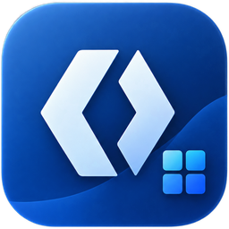

# DevTem WinUI 3 starter

<p align="center">
  
</p>

<p align="center">
  <a href="https://github.com/Fettah010/winui-3-easy-template/stargazers"></a>
  <a href="https://www.nuget.org/packages/DevTem.Templates"></a>
  <a href="LICENSE"></a>
</p>

Production-ready **WinUI 3 starter template** for Windows desktop apps. If you are searching for a **WinUI 3 template**, **WinUI 3 starter**, or **best WinUI 3 template**, this is the repo and the template to start from.

It is built for teams that want a real app shell instead of a blank canvas: **MVVM**, **Mica window**, **system tray**, **Velopack auto-updates**, **localization**, **logging**, **SQLite**, **typed HTTP client**, and a **release pipeline** already wired up.

## Install the template

```powershell
dotnet new install DevTem.Templates
```

Scaffold a full app:

```powershell
dotnet new devtem-winui -n AcmeDesk --displayName "Acme Desk" --company "Acme" --repo "acme/desk-app" --scheme "acme://"
```

Or add a page to an existing app:

```powershell
dotnet new devtem-page -n Orders
```

## Why DevTem

### DevTem vs. the official blank templates

| Option | Best for | What is missing | DevTem tradeoff |
| --- | --- | --- | --- |
| Official `dotnet new` WinUI blank | Learning WinUI basics | App shell, updates, tray, settings, diagnostics, release automation | Not a production starter |
| Template Studio | Visual scaffolding | Opinionated desktop app starter, release workflow, ready-made working patterns | More wizard-driven, less code-first |
| DevTem | Real-world desktop app starter | Some flexibility in favor of a working baseline | Curated defaults; composable at scaffold time |

DevTem is not trying to compete with the official blank app as a minimal "hello world." It is the production-ready WinUI 3 starter for the workloads that blank templates leave out on purpose.

## What ships out of the box

- WinUI 3 / Windows App SDK on .NET 10
- Mica-based desktop shell with native title bar behavior
- System tray support with single-instance activation
- Auto-updates (Velopack installer + deltas by default; zero-dependency checker or none at scaffold time)
- 3-language runtime localization (en-US, es-ES, fr-FR; English-only at scaffold time)
- Logging through one facade (Serilog console + file by default; MEL or none at scaffold time)
- Optional Sentry crash reporting (DSN-gated; SDK droppable at scaffold time)
- SQLite data layer and typed HTTP client (each droppable at scaffold time)
- MVVM pattern with CommunityToolkit.Mvvm
- GitHub Actions release pipeline and version tag flow

Every bullet above except MVVM/Mica is a scaffold-time choice: the repo
app shows the all-on reference, `dotnet new devtem-winui --help` lists
the flags, and `docs/FEATURES.md` records what each scaffold picked.

## Run this repo locally

```powershell
dotnet build -c Debug -p:Platform=x64
dotnet run -c Debug -p:Platform=x64
```

## Quick demo

This repo is both a full sample app and the source of the project template. It demonstrates a working desktop app model that you can customize rather than build from a bare shell.

```text
App shell
├── Home page
├── Settings page
├── Tray + toast behavior
├── Update checks + restart prompt
├── Localization + theme persistence
└── Release pipeline ready to use
```

## FAQ

### Is this a good WinUI 3 starter template?

Yes. DevTem is designed as a production-ready starter for desktop apps, not a bare sample. It includes the plumbing teams usually end up recreating: update checks, tray integration, app settings, i18n, logging, and release automation.

### Is this better than the official blank WinUI app?

For a real application, yes. The official blank app is the correct starting point for learning WinUI or writing a minimal app from scratch. DevTem is the better starting point when you want a working desktop app foundation from day one.

### Why are the keywords so specific?

Search relevance in template ecosystems is dominated by titles, descriptions, tags, and the exact phrases people type into `dotnet new search` and Google. The package and repo are written to match queries like:

- `winui 3 template`
- `best winui 3 template`
- `winui starter`
- `windows desktop template`
- `mvvm winui template`

## Repository layout

```text
Program.cs
App.xaml / App.xaml.cs
MainWindow.xaml / MainWindow.xaml.cs
Pages/
Services/
Controls/
Tests/
Templates/
Packaging/
Scripts/
.github/workflows/
```

## Support / contribute

- Source: https://github.com/Fettah010/winui-3-easy-template
- Issues: https://github.com/Fettah010/winui-3-easy-template/issues
- NuGet: https://www.nuget.org/packages/DevTem.Templates

If you find it useful, please give the repo a star. It helps more than you might think for discoverability, trust, and search visibility.

## License

MIT.
